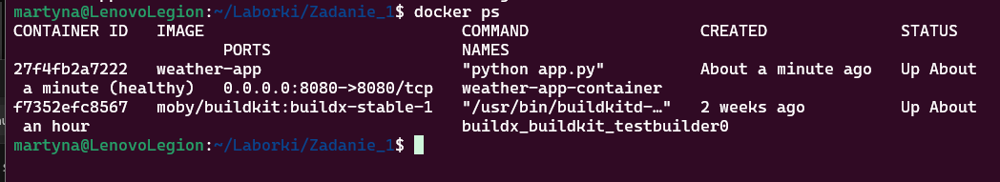
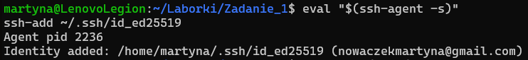
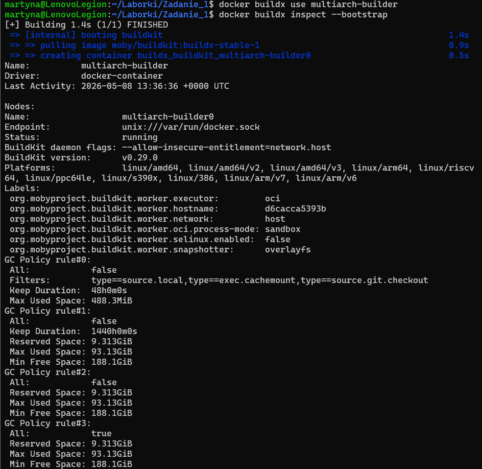
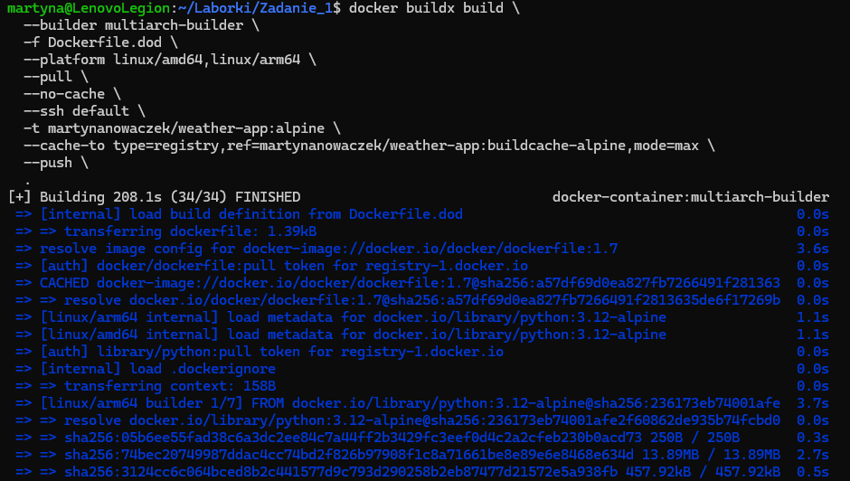
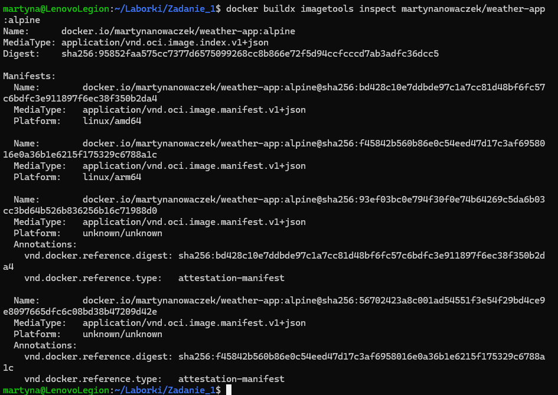
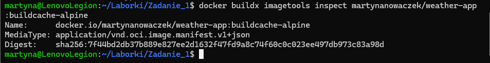
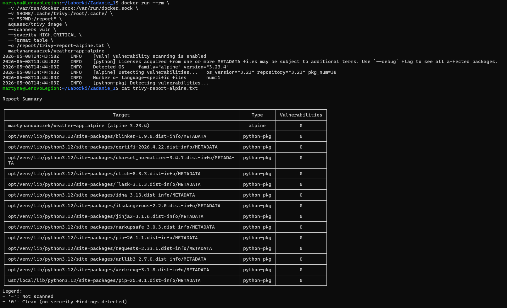

# Aplikacja pogodowa w Dockerze

Autor: Martyna Nowaczek  

---

## Opis

Aplikacja webowa napisana w Pythonie (Flask)

---

## Dostęp do aplikacji

Aplikacja dostępna jest pod adresem:

http://localhost:8080

---

## Polecenia

### a) Zbudowanie obrazu kontenera

docker build -t weather-app .

---

### b) Uruchomienie kontenera

docker run -d --name weather-app-container -p 8080:8080 weather-app

---

### c) Odczyt logów aplikacji

docker logs weather-app-container

Logi zawierają:
- datę uruchomienia aplikacji  
- autora  
- port TCP (8080)  

---

### d) Sprawdzenie warstw i rozmiaru obrazu

docker history weather-app  
docker images weather-app  

---

## Uruchomienie aplikacji (WSL)

explorer.exe http://localhost:8080

---

# ZADANIE DODATKOWE
Po utworzeniu Dockerfile.dod:

## Dostępność klucza do GitHuba

eval "$(ssh-agent -s)"
ssh-add ~/.ssh/id_ed25519

---

## Sprawdzenie klucza do github

ssh -T git@github.com

---

## Ustawienie i sprawdzenie multiarch-builder

docker buildx use multiarch-builder
docker buildx inspect --bootstrap

---

## Budowanie obrazu, utowrzenie manifestu, wypchnięcie obrazu na DockerHub, utworzenie cache

docker buildx build \
  --builder multiarch-builder \
  -f Dockerfile.dod \
  --platform linux/amd64,linux/arm64 \
  --pull \
  --no-cache \
  --ssh default \
  -t martynanowaczek/weather-app:alpine \
  --cache-to type=registry,ref=martynanowaczek/weather-app:buildcache-alpine,mode=max \
  --push \
  .

---

## Sprawdzenie manifestu

 docker buildx imagetools inspect martynanowaczek/weather-app:alpine

---

## Sprawdzenie cache

docker buildx imagetools inspect martynanowaczek/weather-app:buildcache-alpine

---

## Test Trivy - raport w załączonym pliku

docker run --rm \
  -v /var/run/docker.sock:/var/run/docker.sock \
  -v $HOME/.cache/trivy:/root/.cache/ \
  -v "$PWD:/report" \
  aquasec/trivy image \
  --scanners vuln \
  --severity HIGH,CRITICAL \
  --format table \
  -o /report/trivy-report-alpine.txt \
  martynanowaczek/weather-app:alpine

## Zrzuty ekranu

### Zbudowanie obrazu kontenera

---

### Uruchomienie kontenera

---

### Docker PS

---

### Logi aplikacji

---

### Warstwy obrazu

---

### Uruchomienie aplikacji

---

### Wygląd aplikacji

---

# ZADANIE DODATKOWE

### Dostępność klucza do GitHuba

---

### Ustawienie i sprawdzenie multiarch-builder

---

### Budowanie obrazu, utowrzenie manifestu, wypchnięcie obrazu na DockerHub, utworzenie cache

---

### Sprawdzenie manifestu

---

### Sprawdzenie cache

---

### Test Trivy 

---
