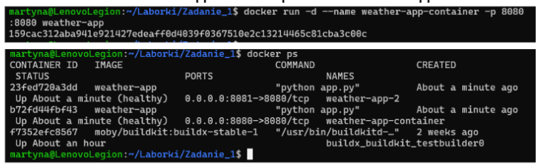
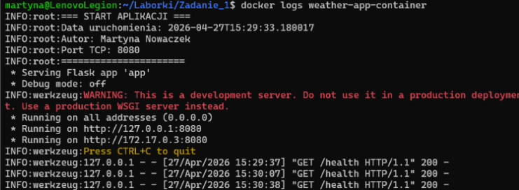
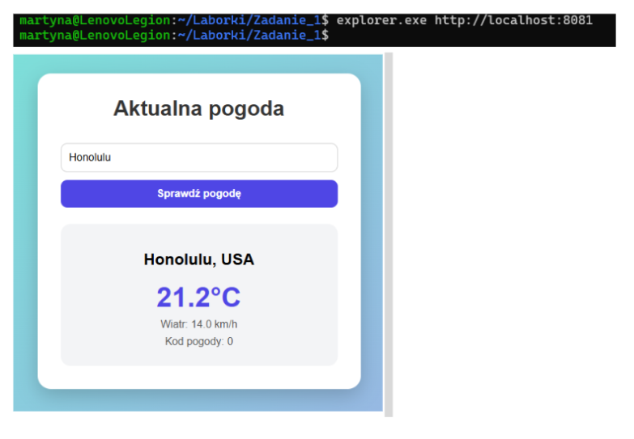

# Aplikacja pogodowa w Dockerze

## Autor: Martyna Nowaczek

### Opis
Aplikacja webowa napisana w Pythonie (Flask)

### Dostęp do aplikacji
http://localhost:8080

#### Polecenia
a. zbudowanie opracowanego obrazu kontenera:
docker build -t weather-app .

b. Uruchomienie kontenera na podstawie zbudowanego obrazu:
docker run -d --name weather-app-container -p 8080:8080 weather-app

c. Sposób uzyskania informacji z logów, które wygenerowała opracowana aplikacja podczas uruchamiana kontenera:
docker logs weather-app-container

d. Sprawdzenie, ile warstw posiada zbudowany obraz oraz jaki jest rozmiar obrazu:
docker history weather-app

##### Uruchomienie aplikacji:
explorer.exe http://localhost:8081

###### Zrzuty ekranu:
# Zbudowanie obrazu kontenera

# Uruchomienie kontenera

# Logi aplikacji

# Warstwy obrazu

# Uruchomienie aplikacji

