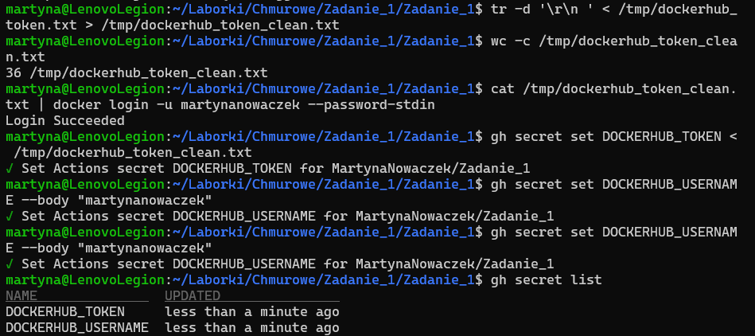
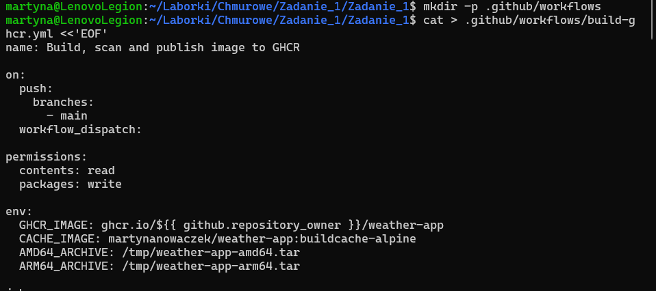
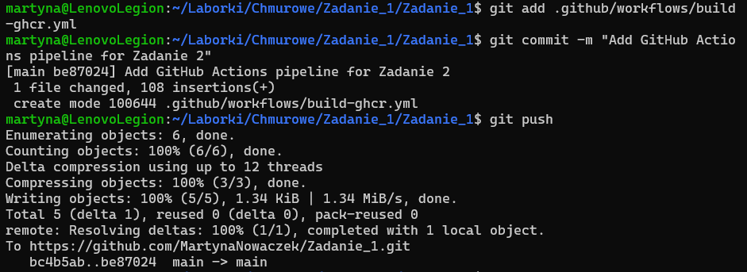
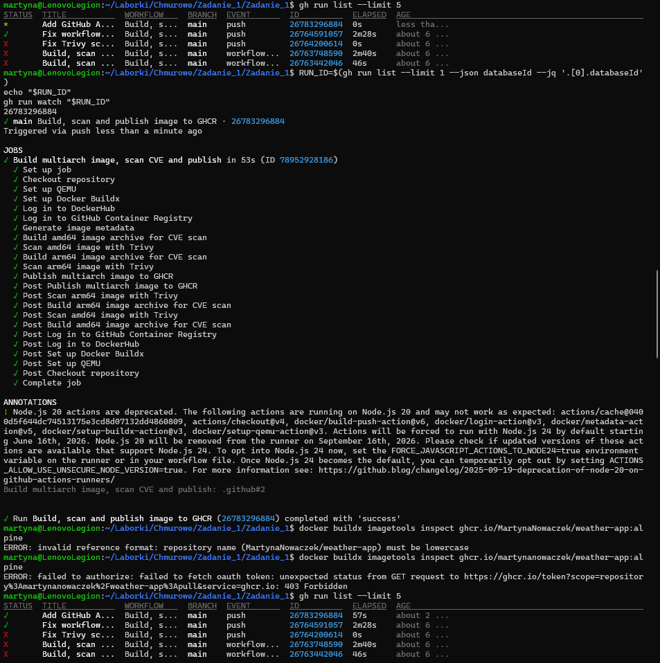
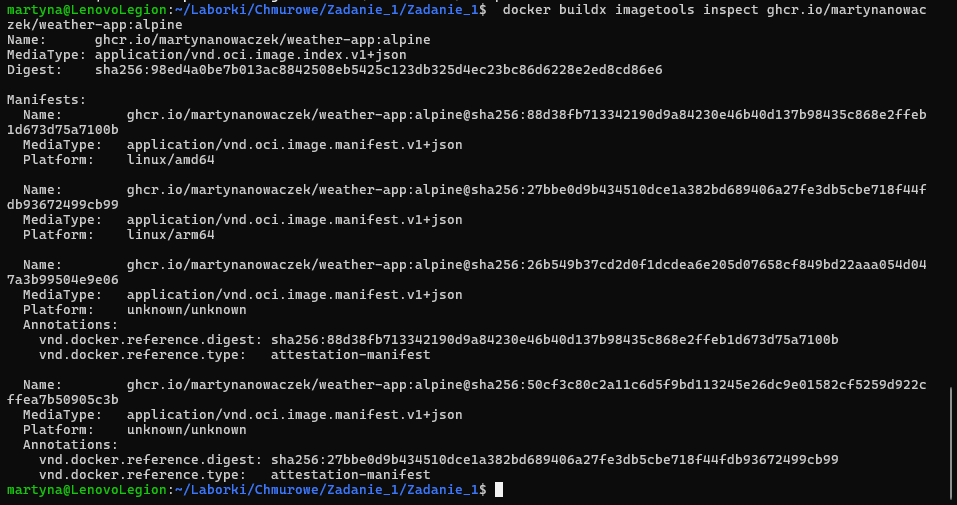

# ZADANIE 2

## Opis rozwiązania

W ramach zadania przygotowano pipeline GitHub Actions, który buduje obraz kontenera aplikacji z Zadania 1 na podstawie pliku `Dockerfile`, wykonuje test CVE oraz publikuje obraz do GitHub Container Registry.

Repozytorium:

```txt
https://github.com/MartynaNowaczek/Zadanie_2
```

Plik workflow:

```txt
.github/workflows/build-ghcr.yml
```

Workflow uruchamia się automatycznie po wykonaniu `push` na gałąź `main`. Można go również uruchomić ręcznie dzięki `workflow_dispatch`.

Pipeline realizuje następujące etapy:

```txt
1. Przygotowanie środowiska Docker Buildx
2. Logowanie do DockerHub
3. Logowanie do GitHub Container Registry
4. Zbudowanie obrazu dla architektury linux/amd64 do skanu CVE
5. Skan CVE obrazu amd64 za pomocą Trivy
6. Zbudowanie obrazu dla architektury linux/arm64 do skanu CVE
7. Skan CVE obrazu arm64 za pomocą Trivy
8. Publikacja finalnego obrazu multiarch do GHCR
9. Weryfikacja opublikowanego obrazu multiarch
```

## Repozytoria obrazów

### Obraz finalny GHCR

Finalny obraz aplikacji publikowany jest w GitHub Container Registry:

```txt
ghcr.io/martynanowaczek/weather-app:alpine
```

Obraz posiada również tag powiązany z konkretnym commitem:

```txt
ghcr.io/martynanowaczek/weather-app:alpine-sha-<short_sha>
```

### Cache BuildKit DockerHub

Dane cache BuildKit przechowywane są w dedykowanym publicznym repozytorium DockerHub:

```txt
martynanowaczek/weather-app-cache:buildcache-alpine
```

Repozytorium:

```txt
https://hub.docker.com/r/martynanowaczek/weather-app-cache/tags
```

Repozytorium `weather-app-cache` służy wyłącznie do przechowywania cache BuildKit. Finalny obraz aplikacji publikowany jest osobno w GitHub Container Registry, natomiast DockerHub pełni rolę zewnętrznego backendu cache typu `registry`.

Tag `buildcache-alpine` nie jest używany jako finalny obraz aplikacji. Służy wyłącznie jako cache BuildKit wykorzystywany podczas kolejnych uruchomień workflow.

## Obsługiwane architektury

Finalny obraz wspiera wymagane architektury:

```txt
linux/amd64
linux/arm64
```

W workflow obraz multiarch publikowany jest w kroku:

```txt
Publish multiarch image to GHCR
```

Do weryfikacji opublikowanego obrazu można użyć polecenia:

```bash
docker buildx imagetools inspect ghcr.io/martynanowaczek/weather-app:alpine
```

Wynik polecenia powinien potwierdzić obecność obu platform:

```txt
linux/amd64
linux/arm64
```

## Cache BuildKit

W pipeline wykorzystano cache BuildKit przechowywany w dedykowanym repozytorium DockerHub. Dane cache są pobierane i wysyłane z użyciem backendu `registry` w trybie `mode=max`.

Fragment konfiguracji:

```yaml
cache-from: type=registry,ref=docker.io/martynanowaczek/weather-app-cache:buildcache-alpine
cache-to: type=registry,ref=docker.io/martynanowaczek/weather-app-cache:buildcache-alpine,mode=max
```

Zastosowanie backendu `registry` pozwala przechowywać cache poza lokalnym środowiskiem GitHub Actions, dzięki czemu może on być ponownie wykorzystany w kolejnych uruchomieniach pipeline. Tryb `mode=max` umożliwia zapisanie większej liczby warstw cache, w tym warstw pośrednich, co może skrócić czas kolejnych buildów.

## Test CVE

Do testu CVE wykorzystano skaner Trivy.

Skan wykonywany jest przed publikacją obrazu do GHCR. Pipeline blokuje publikację obrazu, jeżeli zostaną wykryte podatności sklasyfikowane jako:

```txt
HIGH
CRITICAL
```

Fragment konfiguracji Trivy:

```yaml
vuln-type: os,library
severity: HIGH,CRITICAL
exit-code: 1
```

Parametr `exit-code: 1` powoduje zakończenie workflow błędem w przypadku wykrycia podatności o wskazanym poziomie ważności. Dzięki temu obraz zostanie opublikowany do GHCR tylko wtedy, gdy skan CVE nie wykryje podatności typu `HIGH` lub `CRITICAL`.

W workflow skan wykonywany jest osobno dla obu architektur:

```txt
Scan amd64 image with Trivy
Scan arm64 image with Trivy
```

Dopiero po pozytywnym wyniku obu skanów wykonywany jest push finalnego obrazu multiarch do GHCR.

## Schemat tagowania

| Element                    | Tag                                                          |
| -------------------------- | ------------------------------------------------------------ |
| Finalny obraz GHCR         | `ghcr.io/martynanowaczek/weather-app:alpine`                 |
| Obraz powiązany z commitem | `ghcr.io/martynanowaczek/weather-app:alpine-sha-<short_sha>` |
| Cache BuildKit DockerHub   | `martynanowaczek/weather-app-cache:buildcache-alpine`        |

Tag `alpine` oznacza aktualny finalny obraz aplikacji z gałęzi `main`.

Tag `alpine-sha-<short_sha>` pozwala jednoznacznie powiązać obraz z konkretną wersją kodu źródłowego. Dzięki temu możliwe jest odtworzenie, z którego commita został zbudowany dany obraz.

Tag `buildcache-alpine` jest używany wyłącznie do przechowywania danych cache BuildKit. Oddzielenie repozytorium cache od repozytorium finalnego obrazu pozwala zachować czytelny podział na obraz aplikacji oraz dane pomocnicze wykorzystywane podczas budowania.

## Uzasadnienie wyboru

Do skanowania CVE wybrano Trivy, ponieważ łatwo integruje się z GitHub Actions i pozwala zatrzymać pipeline przez `exit-code: 1`, jeżeli wykryte zostaną podatności o wskazanym poziomie ważności. W tym rozwiązaniu blokowane są podatności sklasyfikowane jako `HIGH` oraz `CRITICAL`.

Do cache BuildKit zastosowano backend `registry` z trybem `mode=max`, ponieważ pozwala on przechowywać cache w zewnętrznym rejestrze DockerHub i wykorzystywać go pomiędzy kolejnymi uruchomieniami workflow. Dzięki temu kolejne budowania obrazu mogą korzystać z wcześniej zapisanych warstw.

Zastosowano tag `alpine` jako czytelny tag finalnego obrazu aplikacji oraz tag `alpine-sha-<short_sha>`, aby możliwe było jednoznaczne powiązanie obrazu z konkretną wersją kodu. Cache BuildKit posiada osobne, dedykowane repozytorium `weather-app-cache` oraz tag `buildcache-alpine`, ponieważ nie jest on finalnym obrazem aplikacji, lecz danymi pomocniczymi wykorzystywanymi przez BuildKit.

## Źródła

* Docker Docs — Registry cache: https://docs.docker.com/build/cache/backends/registry/
* Docker Docs — Cache storage backends: https://docs.docker.com/build/cache/backends/
* Trivy Docs — Exit code: https://trivy.dev/latest/docs/configuration/others/

## Potwierdzenie działania

Workflow został uruchomiony i zakończył się sukcesem.

W udanym uruchomieniu wykonano kroki:

```txt
Build amd64 image archive for CVE scan
Scan amd64 image with Trivy
Build arm64 image archive for CVE scan
Scan arm64 image with Trivy
Publish multiarch image to GHCR
Verify published multiarch image
```

Poprawność działania potwierdzono przez:

```txt
1. Udane zakończenie workflow GitHub Actions
2. Wykonanie skanów Trivy dla obu architektur
3. Publikację obrazu multiarch do GHCR
4. Weryfikację manifestu obrazu za pomocą docker buildx imagetools inspect
5. Obecność cache BuildKit w dedykowanym repozytorium DockerHub weather-app-cache
```

## Zrzuty ekranu z realizacji

### 1. Dodanie sekretów GitHub Actions



### 2. Utworzenie workflow



### 3. Commit i push workflow



### 4. Udane wykonanie pipeline



### 5. Weryfikacja obrazu multiarch



### 6. Sprawdzenie cache BuildKit w dedykowanym repozytorium DockerHub

