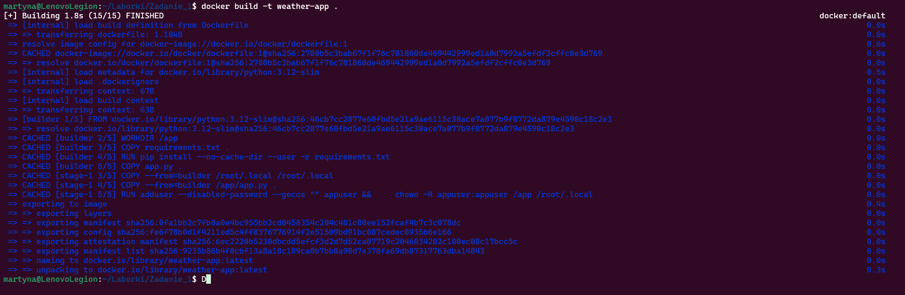
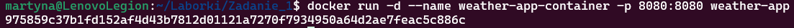
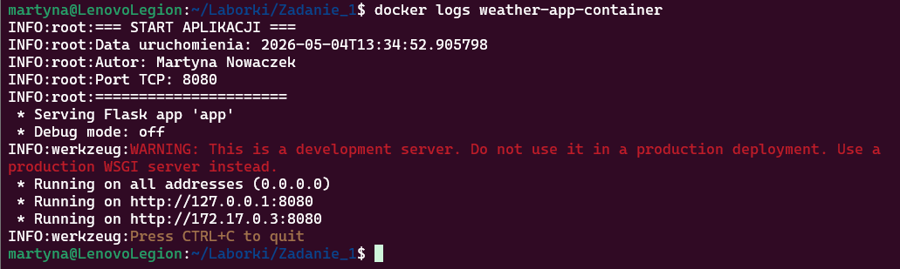
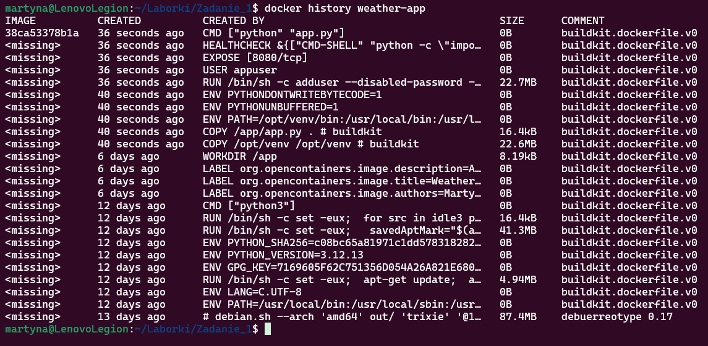
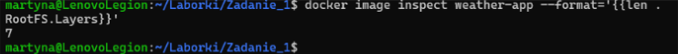
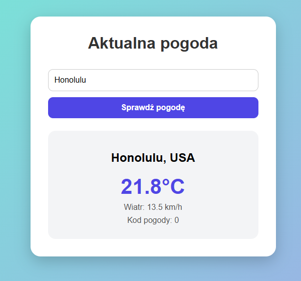

# Aplikacja pogodowa w Dockerze

Autor: Martyna Nowaczek  

---

## Opis

Aplikacja webowa napisana w Pythonie (Flask)

---

## Dostęp do aplikacji

Aplikacja dostępna jest pod adresem:

http://localhost:8080

---

## Polecenia

### a) Zbudowanie obrazu kontenera

docker build -t weather-app .

---

### b) Uruchomienie kontenera

docker run -d --name weather-app-container -p 8080:8080 weather-app

---

### c) Odczyt logów aplikacji

docker logs weather-app-container

Logi zawierają:
- datę uruchomienia aplikacji  
- autora  
- port TCP (8080)  

---

### d) Sprawdzenie warstw i rozmiaru obrazu

docker history weather-app  
docker images weather-app  

---

## Uruchomienie aplikacji (WSL)

explorer.exe http://localhost:8080

---

## Zrzuty ekranu

### Zbudowanie obrazu kontenera

---

### Uruchomienie kontenera

---

### Logi aplikacji

---

### Warstwy obrazu

---

### Uruchomienie aplikacji

---

### Uruchomienie aplikacji
